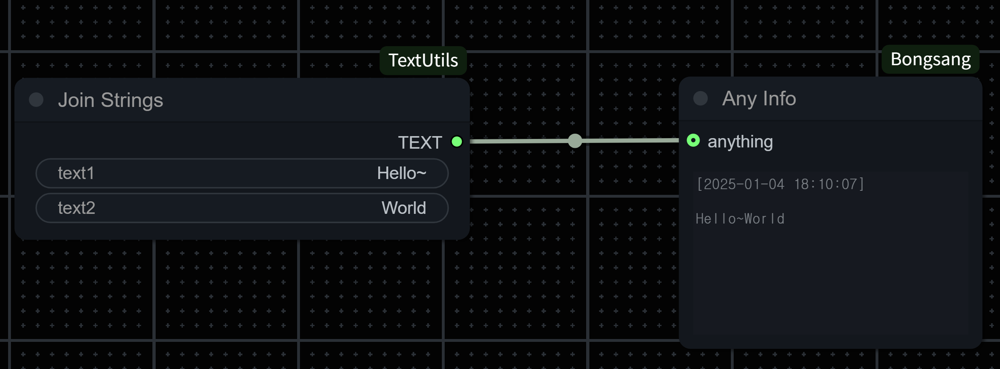
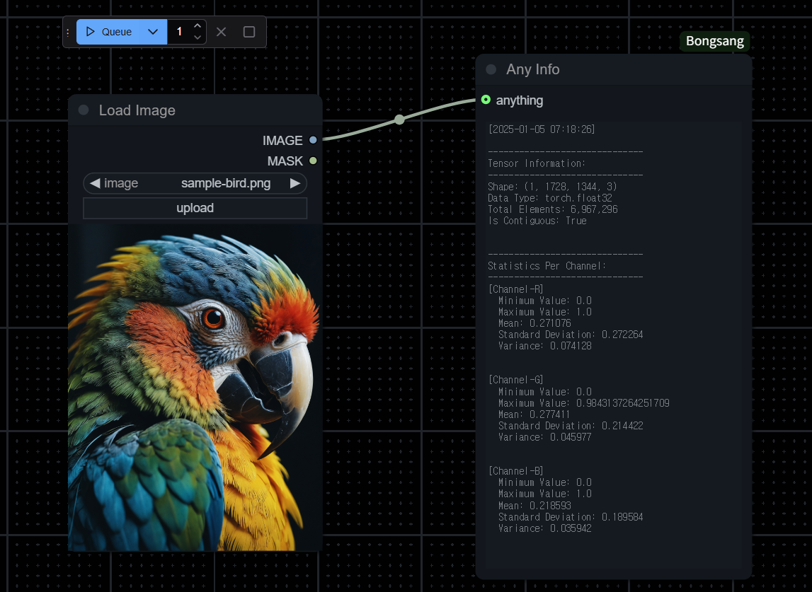
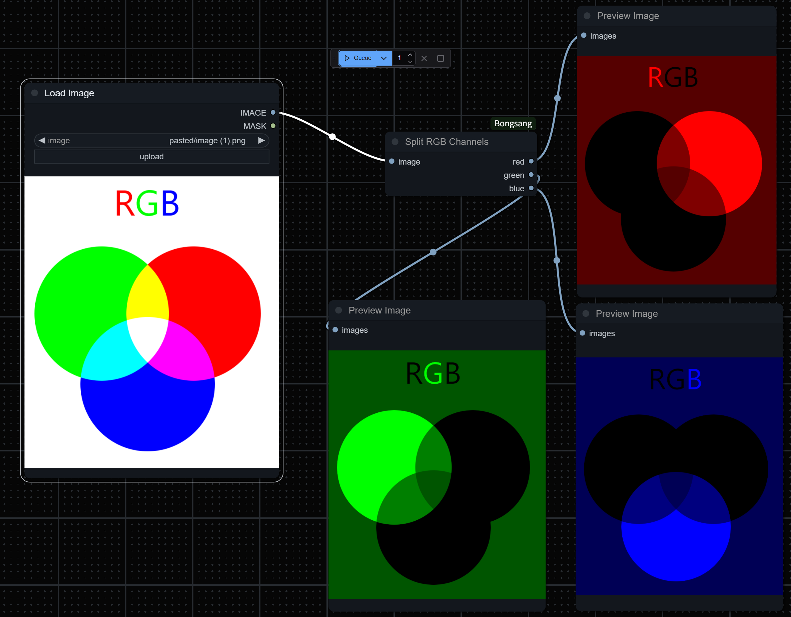
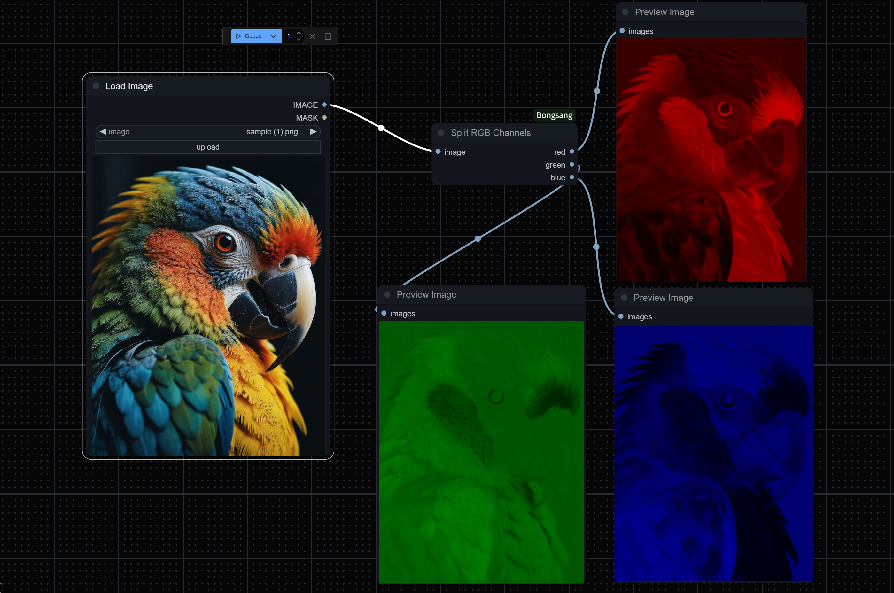

# ComfyUI-Bongsang

**ComfyUI-Bongsang** is a versatile and unique custom node package designed for diffusion model developers. This tool simplifies workflows and enhances the user experience by providing powerful utilities for handling diverse data types.

---

## Installation

ComfyUI-Bongsang consolidates all custom nodes into a single package for ease of use.

- **ComfyUI and CLI**: Read how to install ComfyUI via CLI: [comfy-cli/getting-started](https://docs.comfy.org/comfy-cli/getting-started)
- Install custom node, ***bongsang***

```
comfy node registry-install bongsang
```


## Features

### 1. **"Any Info" Node**

The **Any Info** node enables seamless inspection of various data types, including strings, numbers, and images, through a single connection. This feature streamlines workflows and saves valuable development time.

#### Example for String Input Type

With the **Any Info** node, you can visualize string outputs effortlessly:



#### Example for Image Input Type

Inspect image outputs in real-time using the **Any Info** node:



---


### 2. **"RGB Channel" Node**

The **RGB Channel** node splits an input image into its three RGB channels: **Red**, **Green**, and **Blue**. Each channel is normalized for better clarity, allowing users to distinguish between pure colors and white regions.

#### How It Works

- Normalization:
Each channel value is divided by the maximum intensity (max_intensity) across all channels for every pixel. This ensures that areas with high intensity in all channels (e.g., white regions) appear dimmer, highlighting pure red, green, or blue areas.

- Channel Separation:
Each channel (R, G, B) is placed in the corresponding slot (0, 1, or 2) while the other channels remain zero.


#### Understanding Color Channels

Split a simple RGB representation image into its Red, Green, and Blue channels:



#### Example for Real-World Image

Applied to a real-world image, the **RGB Channel** node highlights the contributions of each channel:

- Red Channel: Displays red intensity.
- Green Channel: Displays green intensity.
- Blue Channel: Displays blue intensity.




---

## Contacts

For collaboration opportunities, feel free to connect:

[LinkedIn - Bongsang](https://www.linkedin.com/in/bongsang/)