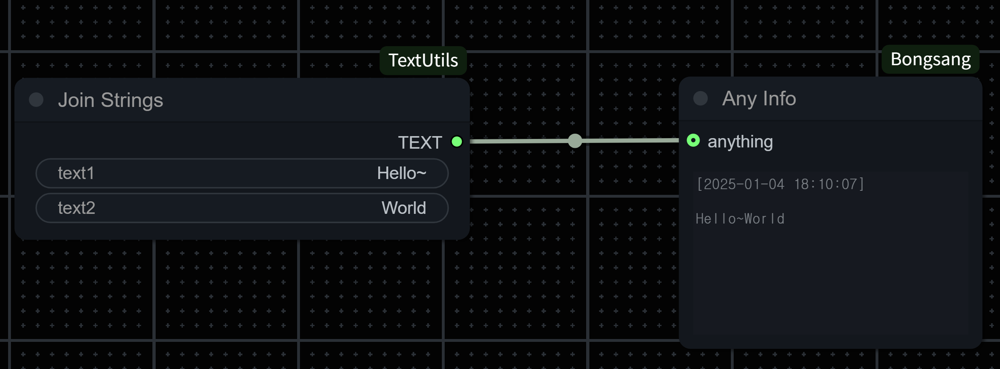

# ComfyUI-Bongsang

**ComfyUI-Bongsang** is a versatile and unique custom node package designed for diffusion model developers. This tool simplifies workflows and enhances the user experience by providing powerful utilities for handling diverse data types.

---

## Features

### 1. **"Any Info" Node**

The **"Any Info"** node allows you to inspect various types of data, including strings, numbers, and images, with a single connection. This functionality saves time and ensures seamless data handling during development.

#### String Example

With the **"Any Info"** node, you can visualize string outputs effortlessly:

#### Image Example

Inspect image outputs in real-time using the **"Any Info"** node:

---

### Why Use ComfyUI-Bongsang?

- **Versatility**: Handle multiple data types within a single node.
- **Efficiency**: Streamline debugging and development processes.
- **Ease of Use**: Simple integration into your existing workflow.
